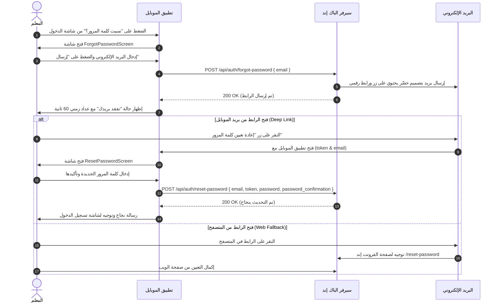

# 📱 دليل وتوثيق تكامل ميزة نسيان كلمة المرور وتأكيد البريد لتطبيق الموبايل
# (Mobile App Integration Guide: Forgot Password & Email Verification)

> **المنصة المستهدفة:** تطبيق الموبايل (Flutter / React Native / Native iOS & Android).  
> **الهدف:** توفير دليل عملي وعقود API كاملة مع نماذج كود برمجية جاهزة (Dart/Flutter) لتنفيذ شاشات استعادة كلمة المرور، الروابط العميقة (Deep Links)، وتأكيد البريد الإلكتروني.

---

## 📑 الفهرس
1. [مخطط دورة العمل لاستعادة كلمة المرور (Forgot Password Workflow)](#1-مخطط-دورة-العمل-لاستعادة-كلمة-المرور)
2. [عقود ومسارات الـ API (API Specifications)](#2-عقود-ومسارات-الـ-api)
   - [طلب رابط إعادة التعيين (Forgot Password)](#أ-طلب-رابط-إعادة-التعيين-post-apiauthforgot-password)
   - [تعيين كلمة المرور الجديدة (Reset Password)](#ب-تعيين-كلمة-المرور-الجديدة-post-apiauthreset-password)
3. [إعداد الروابط العميقة (Deep Links / Universal Links)](#3-إعداد-الروابط-العميقة-deep-links)
4. [نماذج البيانات وكود الـ Repository بلغة Dart](#4-نماذج-البيانات-وكود-الـ-repository-بلغة-dart)
5. [شاشات وواجهات المستخدم الجاهزة في Flutter](#5-شاشات-وواجهات-المستخدم-الجاهزة-في-flutter)
   - [شاشة نسيت كلمة المرور (ForgotPasswordScreen)](#أ-شاشة-نسيت-كلمة-المرور-forgotpasswordscreen)
   - [شاشة تعيين كلمة المرور الجديدة (ResetPasswordScreen)](#ب-شاشة-تعيين-كلمة-المرور-الجديدة-resetpasswordscreen)
6. [الربط مع شاشة تسجيل الدخول (LoginScreen Integration)](#6-الربط-مع-شاشة-تسجيل-الدخول)
7. [معالجة الأخطاء وحالات الاستجابة (Error Handling Contract)](#7-معالجة-الأخطاء-وحالات-الاستجابة)
8. [قائمة الفحص والاختبار (Testing & QA Checklist)](#8-قائمة-الفحص-والاختبار)

---

## 1. مخطط دورة العمل لاستعادة كلمة المرور



---

## 2. عقود ومسارات الـ API

### أ) طلب رابط إعادة التعيين (Forgot Password)
`POST /api/auth/forgot-password` *(Public - معدل الطلبات: 6 طلبات/دقيقة)*

**Headers:**
```http
Accept: application/json
Content-Type: application/json
```

**Request Body:**
```json
{
  "email": "teacher@moe.edu.sa"
}
```

**Responses:**
- **200 OK (نجاح الإرسال أو بريد غير مسجل لحماية الأمان):**
```json
{
  "success": true,
  "message": "تم إرسال رابط إعادة تعيين كلمة المرور إلى بريدك الإلكتروني بنجاح"
}
```
- **422 Unprocessable Entity (خطأ في صيغة البريد):**
```json
{
  "message": "خطأ في البيانات",
  "errors": {
    "email": ["يرجى إدخال بريد إلكتروني صحيح"]
  }
}
```
- **429 Too Many Requests (تجاوز حد الطلبات):**
```json
{
  "message": "Too Many Requests."
}
```

---

### ب) تعيين كلمة المرور الجديدة (Reset Password)
`POST /api/auth/reset-password` *(Public)*

**Headers:**
```http
Accept: application/json
Content-Type: application/json
```

**Request Body:**
```json
{
  "email": "teacher@moe.edu.sa",
  "token": "49bf301931da7034c441c0989be0e7136014ba512b9a710bc4...",
  "password": "NewPassword1234",
  "password_confirmation": "NewPassword1234"
}
```

**Responses:**
- **200 OK (تم تغيير كلمة المرور بنجاح):**
```json
{
  "success": true,
  "message": "تم تغيير كلمة المرور بنجاح، يمكنك الآن تسجيل الدخول"
}
```
- **422 Unprocessable Entity (الـ Token غير صالح أو منتهي الصلاحية):**
```json
{
  "message": "رابط إعادة تعيين كلمة المرور غير صالح أو منتهي الصلاحية",
  "code": "invalid_token",
  "status": 422
}
```
- **422 Unprocessable Entity (كلمة المرور غير متطابقة أو أقل من 8 أحرف):**
```json
{
  "message": "خطأ في البيانات",
  "errors": {
    "password": ["تأكيد كلمة المرور غير متطابق"]
  }
}
```

---

## 3. إعداد الروابط العميقة (Deep Links)

لتمكين فتح شاشة إعادة التعيين في تطبيق الموبايل مباشرة عند النقر على الزر في البريد:

### 1) إعداد Android (`android/app/src/main/AndroidManifest.xml`)
داخل وسم `<activity>` الرئيسي:
```xml
<intent-filter android:autoVerify="true">
    <action android:name="android.intent.action.VIEW" />
    <category android:name="android.intent.category.DEFAULT" />
    <category android:name="android.intent.category.BROWSABLE" />
    <!-- المخطط المباشر للتطبيق -->
    <data android:scheme="hader" android:host="reset-password" />
    <!-- أو Universal Link الخاص بموقعكم -->
    <data android:scheme="https" android:host="app.yourdomain.com" android:pathPrefix="/reset-password" />
</intent-filter>
```

### 2) إعداد iOS (`ios/Runner/Info.plist`)
```xml
<key>CFBundleURLTypes</key>
<array>
    <dict>
        <key>CFBundleTypeRole</key>
        <string>Editor</string>
        <key>CFBundleURLSchemes</key>
        <array>
            <string>hader</string>
        </array>
    </dict>
</array>
```

---

## 4. نماذج البيانات وكود الـ Repository بلغة Dart

### `lib/repositories/auth_repository.dart`
```dart
import 'package:dio/dio.dart';

class AuthRepository {
  final Dio dio;

  AuthRepository(this.dio);

  /// 1. طلب إرسال رابط نسيان كلمة المرور
  Future<String> forgotPassword(String email) async {
    try {
      final response = await dio.post('/auth/forgot-password', data: {
        'email': email.trim(),
      });
      return response.data['message'] ?? 'تم إرسال رابط الاستعادة إلى بريدك الإلكتروني';
    } on DioException catch (e) {
      throw _extractErrorMessage(e, 'تعذر إرسال رابط استعادة كلمة المرور');
    }
  }

  /// 2. تعيين كلمة المرور الجديدة
  Future<String> resetPassword({
    required String email,
    required String token,
    required String password,
    required String passwordConfirmation,
  }) async {
    try {
      final response = await dio.post('/auth/reset-password', data: {
        'email': email.trim(),
        'token': token.trim(),
        'password': password,
        'password_confirmation': passwordConfirmation,
      });
      return response.data['message'] ?? 'تم تغيير كلمة المرور بنجاح';
    } on DioException catch (e) {
      throw _extractErrorMessage(e, 'تعذر تغيير كلمة المرور، يرجى المحاولة لاحقاً');
    }
  }

  String _extractErrorMessage(DioException e, String fallback) {
    if (e.response?.data != null) {
      final data = e.response!.data;
      if (data is Map<String, dynamic>) {
        if (data['message'] != null) return data['message'].toString();
        if (data['errors'] != null && data['errors'] is Map) {
          final errors = data['errors'] as Map;
          if (errors.isNotEmpty) {
            return errors.values.first[0].toString();
          }
        }
      }
    }
    if (e.type == DioExceptionType.connectionTimeout || e.type == DioExceptionType.connectionError) {
      return 'تعذر الاتصال بالخادم، يرجى التحقق من اتصال الإنترنت';
    }
    return fallback;
  }
}
```

---

## 5. شاشات وواجهات المستخدم الجاهزة في Flutter

### أ) شاشة نسيت كلمة المرور (`ForgotPasswordScreen`)
#### `lib/screens/auth/forgot_password_screen.dart`
```dart
import 'dart:async';
import 'package:flutter/material.dart';
import '../../repositories/auth_repository.dart';

class ForgotPasswordScreen extends StatefulWidget {
  final AuthRepository authRepository;

  const ForgotPasswordScreen({Key? key, required this.authRepository}) : super(key: key);

  @override
  State<ForgotPasswordScreen> createState() => _ForgotPasswordScreenState();
}

class _ForgotPasswordScreenState extends State<ForgotPasswordScreen> {
  final _formKey = GlobalKey<FormState>();
  final _emailController = TextEditingController();
  
  bool _isLoading = false;
  bool _isSent = false;
  int _cooldown = 0;
  Timer? _timer;

  @override
  void dispose() {
    _emailController.dispose();
    _timer?.cancel();
    super.dispose();
  }

  void _startCooldown([int seconds = 60]) {
    setState(() => _cooldown = seconds);
    _timer?.cancel();
    _timer = Timer.periodic(const Duration(seconds: 1), (timer) {
      if (_cooldown <= 1) {
        timer.cancel();
        setState(() => _cooldown = 0);
      } else {
        setState(() => _cooldown--);
      }
    });
  }

  Future<void> _handleSubmit() async {
    if (!_formKey.currentState!.validate()) return;

    setState(() => _isLoading = true);
    try {
      final msg = await widget.authRepository.forgotPassword(_emailController.text);
      setState(() => _isSent = true);
      _startCooldown(60);
      _showToast(msg, isSuccess: true);
    } catch (e) {
      _showToast(e.toString(), isSuccess: false);
    } finally {
      setState(() => _isLoading = false);
    }
  }

  void _showToast(String message, {bool isSuccess = true}) {
    ScaffoldMessenger.of(context).showSnackBar(
      SnackBar(
        content: Text(message),
        backgroundColor: isSuccess ? const Color(0xFF0E7A5E) : Colors.red,
      ),
    );
  }

  @override
  Widget build(BuildContext context) {
    return Scaffold(
      backgroundColor: const Color(0xFFF6FCF9),
      appBar: AppBar(
        title: const Text('استعادة كلمة المرور'),
        backgroundColor: Colors.transparent,
        elevation: 0,
        centerTitle: true,
      ),
      body: SafeArea(
        child: Center(
          child: SingleChildScrollView(
            padding: const EdgeInsets.all(24.0),
            child: _isSent ? _buildSentState() : _buildFormState(),
          ),
        ),
      ),
    );
  }

  Widget _buildFormState() {
    return Form(
      key: _formKey,
      child: Column(
        mainAxisSize: MainAxisSize.min,
        children: [
          Container(
            padding: const EdgeInsets.all(18),
            decoration: const BoxDecoration(
              color: Color(0xFFFFF7E3),
              shape: BoxShape.circle,
            ),
            child: const Icon(Icons.lock_reset_rounded, size: 54, color: Color(0xFFC98D14)),
          ),
          const SizedBox(height: 20),
          const Text(
            'نسيت كلمة المرور؟',
            style: TextStyle(fontSize: 24, fontWeight: FontWeight.bold, color: Color(0xFF0A5C49)),
          ),
          const SizedBox(height: 8),
          const Text(
            'أدخل بريدك الإلكتروني المسجل وسنرسل لك رابطاً آمناً لإعادة تعيين كلمة المرور.',
            style: TextStyle(fontSize: 14, color: Color(0xFF607972), height: 1.5),
            textAlign: TextAlign.center,
          ),
          const SizedBox(height: 24),
          TextFormField(
            controller: _emailController,
            keyboardType: TextInputType.emailAddress,
            textDirection: TextDirection.ltr,
            decoration: InputDecoration(
              labelText: 'البريد الإلكتروني',
              hintText: 'teacher@moe.edu.sa',
              prefixIcon: const Icon(Icons.email_outlined),
              border: OutlineInputBorder(borderRadius: BorderRadius.circular(16)),
              filled: true,
              fillColor: Colors.white,
            ),
            validator: (val) {
              if (val == null || val.trim().isEmpty) return 'البريد الإلكتروني مطلوب';
              if (!val.contains('@') || !val.contains('.')) return 'صيغة البريد غير صحيحة';
              return null;
            },
          ),
          const SizedBox(height: 24),
          ElevatedButton(
            style: ElevatedButton.styleFrom(
              backgroundColor: const Color(0xFF0E7A5E),
              minimumSize: const Size(double.infinity, 50),
              shape: RoundedRectangleBorder(borderRadius: BorderRadius.circular(16)),
            ),
            onPressed: _isLoading ? null : _handleSubmit,
            child: _isLoading
                ? const SizedBox(width: 20, height: 20, child: CircularProgressIndicator(color: Colors.white, strokeWidth: 2))
                : const Text('إرسال رابط إعادة التعيين ←', style: TextStyle(fontSize: 16, fontWeight: FontWeight.bold, color: Colors.white)),
          ),
        ],
      ),
    );
  }

  Widget _buildSentState() {
    return Column(
      mainAxisSize: MainAxisSize.min,
      children: [
        const Icon(Icons.mark_email_read_rounded, size: 72, color: Color(0xFF0E7A5E)),
        const SizedBox(height: 16),
        const Text(
          'تم إرسال الرابط بنجاح ✉️',
          style: TextStyle(fontSize: 22, fontWeight: FontWeight.bold, color: Color(0xFF0A5C49)),
        ),
        const SizedBox(height: 12),
        Text(
          'أرسلنا رسالة إلى ${_emailController.text} تحتوي على زر إعادة التعيين.',
          style: const TextStyle(fontSize: 14, color: Color(0xFF607972)),
          textAlign: TextAlign.center,
        ),
        const SizedBox(height: 24),
        OutlinedButton.icon(
          style: OutlinedButton.styleFrom(
            minimumSize: const Size(double.infinity, 50),
            side: const BorderSide(color: Color(0xFF0E7A5E)),
            shape: RoundedRectangleBorder(borderRadius: BorderRadius.circular(16)),
          ),
          icon: const Icon(Icons.refresh_rounded, color: Color(0xFF0E7A5E)),
          label: Text(
            _cooldown > 0 ? 'إعادة الإرسال بعد ($_cooldown ث)' : 'إعادة إرسال الرابط',
            style: const TextStyle(color: Color(0xFF0E7A5E), fontWeight: FontWeight.bold),
          ),
          onPressed: _cooldown > 0 || _isLoading ? null : _handleSubmit,
        ),
        const SizedBox(height: 12),
        TextButton(
          onPressed: () => Navigator.pop(context),
          child: const Text('العودة لتسجيل الدخول ←', style: TextStyle(color: Color(0xFF5A746D))),
        ),
      ],
    );
  }
}
```

---

### ب) شاشة تعيين كلمة المرور الجديدة (`ResetPasswordScreen`)
#### `lib/screens/auth/reset_password_screen.dart`
```dart
import 'package:flutter/material.dart';
import '../../repositories/auth_repository.dart';

class ResetPasswordScreen extends StatefulWidget {
  final AuthRepository authRepository;
  final String token;
  final String email;

  const ResetPasswordScreen({
    Key? key,
    required this.authRepository,
    required this.token,
    required this.email,
  }) : super(key: key);

  @override
  State<ResetPasswordScreen> createState() => _ResetPasswordScreenState();
}

class _ResetPasswordScreenState extends State<ResetPasswordScreen> {
  final _formKey = GlobalKey<FormState>();
  final _passwordController = TextEditingController();
  final _confirmPasswordController = TextEditingController();

  bool _obscurePassword = true;
  bool _obscureConfirmPassword = true;
  bool _isLoading = false;
  bool _isSuccess = false;

  @override
  void dispose() {
    _passwordController.dispose();
    _confirmPasswordController.dispose();
    super.dispose();
  }

  Future<void> _handleSubmit() async {
    if (!_formKey.currentState!.validate()) return;

    setState(() => _isLoading = true);
    try {
      final msg = await widget.authRepository.resetPassword(
        email: widget.email,
        token: widget.token,
        password: _passwordController.text,
        passwordConfirmation: _confirmPasswordController.text,
      );

      setState(() => _isSuccess = true);
    } catch (e) {
      ScaffoldMessenger.of(context).showSnackBar(
        SnackBar(content: Text(e.toString()), backgroundColor: Colors.red),
      );
    } finally {
      setState(() => _isLoading = false);
    }
  }

  @override
  Widget build(BuildContext context) {
    return Scaffold(
      backgroundColor: const Color(0xFFF6FCF9),
      appBar: AppBar(
        title: const Text('تعيين كلمة المرور'),
        backgroundColor: Colors.transparent,
        elevation: 0,
        centerTitle: true,
      ),
      body: SafeArea(
        child: Center(
          child: SingleChildScrollView(
            padding: const EdgeInsets.all(24.0),
            child: _isSuccess ? _buildSuccessState() : _buildFormState(),
          ),
        ),
      ),
    );
  }

  Widget _buildFormState() {
    return Form(
      key: _formKey,
      child: Column(
        mainAxisSize: MainAxisSize.min,
        children: [
          const Text(
            'كلمة المرور الجديدة 🔐',
            style: TextStyle(fontSize: 24, fontWeight: FontWeight.bold, color: Color(0xFF0A5C49)),
          ),
          const SizedBox(height: 8),
          Text(
            'تعيين كلمة مرور جديدة للحساب: ${widget.email}',
            style: const TextStyle(fontSize: 14, color: Color(0xFF607972)),
            textAlign: TextAlign.center,
          ),
          const SizedBox(height: 24),
          // كلمة المرور الجديدة
          TextFormField(
            controller: _passwordController,
            obscureText: _obscurePassword,
            decoration: InputDecoration(
              labelText: 'كلمة المرور الجديدة',
              prefixIcon: const Icon(Icons.lock_outline),
              suffixIcon: IconButton(
                icon: Icon(_obscurePassword ? Icons.visibility_off : Icons.visibility),
                onPressed: () => setState(() => _obscurePassword = !_obscurePassword),
              ),
              border: OutlineInputBorder(borderRadius: BorderRadius.circular(16)),
              filled: true,
              fillColor: Colors.white,
            ),
            validator: (val) {
              if (val == null || val.length < 8) return 'كلمة المرور يجب ألا تقل عن 8 أحرف';
              return null;
            },
          ),
          const SizedBox(height: 16),
          // تأكيد كلمة المرور
          TextFormField(
            controller: _confirmPasswordController,
            obscureText: _obscureConfirmPassword,
            decoration: InputDecoration(
              labelText: 'تأكيد كلمة المرور الجديدة',
              prefixIcon: const Icon(Icons.lock_outline),
              suffixIcon: IconButton(
                icon: Icon(_obscureConfirmPassword ? Icons.visibility_off : Icons.visibility),
                onPressed: () => setState(() => _obscureConfirmPassword = !_obscureConfirmPassword),
              ),
              border: OutlineInputBorder(borderRadius: BorderRadius.circular(16)),
              filled: true,
              fillColor: Colors.white,
            ),
            validator: (val) {
              if (val != _passwordController.text) return 'كلمة المرور غير متطابقة';
              return null;
            },
          ),
          const SizedBox(height: 24),
          ElevatedButton(
            style: ElevatedButton.styleFrom(
              backgroundColor: const Color(0xFF0E7A5E),
              minimumSize: const Size(double.infinity, 50),
              shape: RoundedRectangleBorder(borderRadius: BorderRadius.circular(16)),
            ),
            onPressed: _isLoading ? null : _handleSubmit,
            child: _isLoading
                ? const SizedBox(width: 20, height: 20, child: CircularProgressIndicator(color: Colors.white, strokeWidth: 2))
                : const Text('حفظ وتعيين كلمة المرور ←', style: TextStyle(fontSize: 16, fontWeight: FontWeight.bold, color: Colors.white)),
          ),
        ],
      ),
    );
  }

  Widget _buildSuccessState() {
    return Column(
      mainAxisSize: MainAxisSize.min,
      children: [
        const Icon(Icons.check_circle_rounded, size: 80, color: Color(0xFF0E7A5E)),
        const SizedBox(height: 16),
        const Text(
          'تم تغيير كلمة المرور بنجاح! 🎉',
          style: TextStyle(fontSize: 22, fontWeight: FontWeight.bold, color: Color(0xFF0A5C49)),
          textAlign: TextAlign.center,
        ),
        const SizedBox(height: 12),
        const Text(
          'يمكنك الآن تسجيل الدخول إلى حسابك بكلمة المرور الجديدة.',
          style: TextStyle(fontSize: 14, color: Color(0xFF607972)),
          textAlign: TextAlign.center,
        ),
        const SizedBox(height: 28),
        ElevatedButton(
          style: ElevatedButton.styleFrom(
            backgroundColor: const Color(0xFF0E7A5E),
            minimumSize: const Size(double.infinity, 50),
            shape: RoundedRectangleBorder(borderRadius: BorderRadius.circular(16)),
          ),
          onPressed: () {
            Navigator.of(context).popUntil((route) => route.isFirst);
          },
          child: const Text('الانتقال لتسجيل الدخول ←', style: TextStyle(fontWeight: FontWeight.bold, color: Colors.white)),
        ),
      ],
    );
  }
}
```

---

## 6. الربط مع شاشة تسجيل الدخول

في شاشة تسجيل الدخول `LoginScreen`، عند الضغط على زر "نسيت كلمة المرور؟":
```dart
TextButton(
  onPressed: () {
    Navigator.push(
      context,
      MaterialPageRoute(
        builder: (context) => ForgotPasswordScreen(
          authRepository: context.read<AuthRepository>(),
        ),
      ),
    );
  },
  child: const Text(
    'نسيت كلمة المرور؟',
    style: TextStyle(color: Color(0xFF0E7A5E), fontWeight: FontWeight.bold),
  ),
)
```

---

## 7. معالجة الأخطاء وحالات الاستجابة

| رمز الاستجابة (Status) | الرمز الداخلي (`code`) | سبب الخطأ | الإجراء المطلوب في الموبايل |
| :--- | :--- | :--- | :--- |
| **`422 Unprocessable`** | `invalid_token` | الرابط منتهي الصلاحية (أكثر من 60 دقيقة) أو غير صالح. | إظهار تنبيه: "رابط إعادة التعيين منتهي الصلاحية" مع زر لطلب رابط جديد. |
| **`422 Unprocessable`** | `validation_error` | كلمة المرور أقل من 8 خانات أو غير متطابقة. | إظهار رسالة الخطأ تحت الحقل المعني. |
| **`429 Too Many Requests`** | - | محاولة إرسال أكثر من 6 طلبات في الدقيقة. | تشغيل العداد التنازلي ومنع الضغط المتكرر. |

---

## 8. قائمة الفحص والاختبار

- [ ] **طلب الرابط:** إدخال بريد مسجل والتحقق من وصول رسالة البريد بتصميم منصة حضّر وزر التعيين.
- [ ] **العداد الزمني:** التأكد من تفعيل عداد 60 ثانية لزر "إعادة الإرسال".
- [ ] **الـ Deep Link:** النقر على الزر في البريد والتأكد من فتح تطبيق الموبايل على شاشة `ResetPasswordScreen` وتمرير الـ `token` والـ `email`.
- [ ] **تغيير كلمة المرور:** إدخال كلمة مرور جديدة وتأكيدها وتلقي استجابة `200 OK`.
- [ ] **تسجيل الدخول:** التأكد من نجاح تسجيل الدخول بكلمة المرور الجديدة وفشل القديمة.
- [ ] **الروابط المنتهية:** اختبار النقر على رابط قديم بعد 60 دقيقة والتأكد من إظهار رسالة انتهاء الصلاحية بلباقة.
