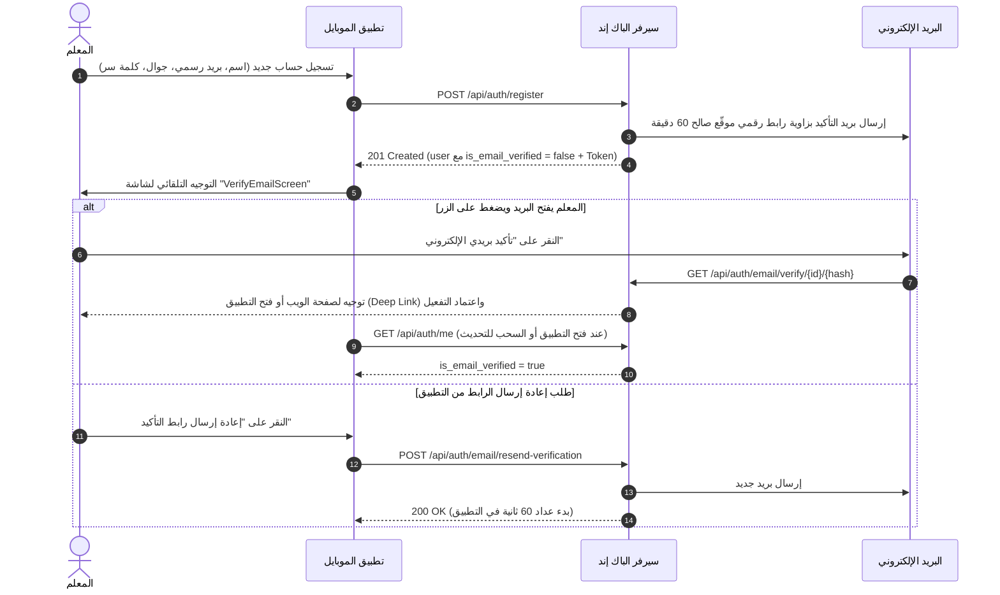

# 📱 خطة تنفيذ وتكامل تطبيق الموبايل (Mobile App Implementation Plan)
## ميزة التحقق من البريد الإلكتروني والمصادقة لمنصة حضّر (Hader Platform)

> **الجمهور المستهدف:** مطور تطبيق الموبايل (Flutter / React Native / Native).  
> **الهدف:** توفير دليل عملي ونماذج برمجية جاهزة لتنفيذ دورة التحقق من البريد الإلكتروني، إدارة الجلسات، التنبيهات، وشاشات المصادقة في تطبيق الموبايل بتوافق كامل مع الباك إند والويب.

---

## 📑 الفهرس
1. [نظرة عامة على دورة العمل (Workflow Overview)](#1-نظرة-عامة-على-دورة-العمل)
2. [هيكلية الملفات والمكونات في الموبايل (Mobile Project Structure)](#2-هيكلية-الملفات-والمكونات-في-الموبايل)
3. [نماذج البيانات (Data Models)](#3-نماذج-البيانات-data-models)
4. [مستودع المصادقة وخدمات الـ API (Auth Repository & Services)](#4-مستودع-المصادقة-وخدمات-الـ-api)
5. [شاشات وواجهات المستخدم (UI Screens & Widgets)](#5-شاشات-وواجهات-المستخدم-ui-screens--widgets)
   - [شاشة التحقق من البريد المخصصة (VerifyEmailScreen)](#أ-شاشة-التحقق-من-البريد-verifyemailscreen)
   - [تعديل شاشة التسجيل (RegisterScreen)](#ب-تعديل-شاشة-التسجيل-registerscreen)
   - [شريط التنبيه العلوي (EmailVerificationBanner)](#ج-شريط-التنبيه-العلوي-emailverificationbanner)
6. [إعداد الروابط العميقة (Deep Links / Universal Links)](#6-إعداد-الروابط-العميقة-deep-links)
7. [عقود الـ API ومسارات الطلبات (API Contracts)](#7-عقود-الـ-api-ومسارات-الطلبات)
8. [معالجة الأخطاء وحالات الاستجابة (Error Handling Contract)](#8-معالجة-الأخطاء-وحالات-الاستجابة)
9. [قائمة التحقق والاختبار (Testing & Verification Checklist)](#9-قائمة-التحقق-والاختبار)

---

## 1. نظرة عامة على دورة العمل



---

## 2. هيكلية الملفات والمكونات في الموبايل

```
lib/
├── models/
│   ├── user_model.dart              # [تعديل] إضافة حقول التحقق من البريد
│   └── teacher_model.dart           # [تحديث] بيانات الخطة والتجربة المجانية
├── repositories/
│   └── auth_repository.dart         # [تعديل] دوال resend و verify و me
├── screens/
│   ├── auth/
│   │   ├── register_screen.dart     # [تعديل] التوجيه لشاشة VerifyEmailScreen بعد التسجيل
│   │   ├── login_screen.dart        # [تعديل] تخزين حالة isEmailVerified
│   │   └── verify_email_screen.dart # [جديد] شاشة التحقق الشاملة (عداد، إعادة إرسال، إرشادات)
│   └── home/
│       └── home_screen.dart         # [تعديل] تضمين شريط التنبيه العلوي
└── widgets/
    └── email_verification_banner.dart # [جديد] شريط التنبيه للمعلمين غير المؤكدين
```

---

## 3. نماذج البيانات (Data Models)

### `lib/models/user_model.dart`
```dart
class UserModel {
  final int id;
  final String name;
  final String email;
  final String role;
  final String? phone;
  final bool isActive;
  final bool isEmailVerified;       // 👈 جديد
  final DateTime? emailVerifiedAt;  // 👈 جديد

  UserModel({
    required this.id,
    required this.name,
    required this.email,
    required this.role,
    this.phone,
    required this.isActive,
    required this.isEmailVerified,
    this.emailVerifiedAt,
  });

  factory UserModel.fromJson(Map<String, dynamic> json) {
    return UserModel(
      id: json['id'] ?? 0,
      name: json['name'] ?? '',
      email: json['email'] ?? '',
      role: json['role'] ?? 'teacher',
      phone: json['phone'],
      isActive: json['is_active'] ?? true,
      isEmailVerified: json['is_email_verified'] ?? false,
      emailVerifiedAt: json['email_verified_at'] != null
          ? DateTime.tryParse(json['email_verified_at'])
          : null,
    );
  }

  Map<String, dynamic> toJson() {
    return {
      'id': id,
      'name': name,
      'email': email,
      'role': role,
      'phone': phone,
      'is_active': isActive,
      'is_email_verified': isEmailVerified,
      'email_verified_at': emailVerifiedAt?.toIso8601String(),
    };
  }

  UserModel copyWith({
    bool? isEmailVerified,
    DateTime? emailVerifiedAt,
  }) {
    return UserModel(
      id: id,
      name: name,
      email: email,
      role: role,
      phone: phone,
      isActive: isActive,
      isEmailVerified: isEmailVerified ?? this.isEmailVerified,
      emailVerifiedAt: emailVerifiedAt ?? this.emailVerifiedAt,
    );
  }
}
```

### `lib/models/teacher_model.dart`
```dart
class TeacherModel {
  final int id;
  final bool isActive;
  final bool isInTrial;
  final bool isSubscribed;
  final bool canPrepareLesson;
  final int aiQuotaRemaining;
  final DateTime? trialEndsAt;
  final int trialDaysRemaining;

  TeacherModel({
    required this.id,
    required this.isActive,
    required this.isInTrial,
    required this.isSubscribed,
    required this.canPrepareLesson,
    required this.aiQuotaRemaining,
    this.trialEndsAt,
    required this.trialDaysRemaining,
  });

  factory TeacherModel.fromJson(Map<String, dynamic> json) {
    return TeacherModel(
      id: json['id'] ?? 0,
      isActive: json['is_active'] ?? true,
      isInTrial: json['is_in_trial'] ?? false,
      isSubscribed: json['is_subscribed'] ?? false,
      canPrepareLesson: json['can_prepare_lesson'] ?? false,
      aiQuotaRemaining: json['ai_quota_remaining'] ?? 0,
      trialEndsAt: json['trial_ends_at'] != null
          ? DateTime.tryParse(json['trial_ends_at'])
          : null,
      trialDaysRemaining: json['trial_days_remaining'] ?? 0,
    );
  }
}
```

---

## 4. مستودع المصادقة وخدمات الـ API

### `lib/repositories/auth_repository.dart`
```dart
import 'package:dio/dio.dart';
import '../models/user_model.dart';
import '../models/teacher_model.dart';

class AuthRepository {
  final Dio dio;

  AuthRepository(this.dio);

  /// 1. تسجيل مستخدم جديد
  Future<Map<String, dynamic>> register({
    required String name,
    required String email,
    required String password,
    required String passwordConfirmation,
    String? phone,
    String? referralCode,
  }) async {
    try {
      final response = await dio.post('/auth/register', data: {
        'name': name,
        'email': email,
        'password': password,
        'password_confirmation': passwordConfirmation,
        if (phone != null && phone.isNotEmpty) 'phone': phone,
        if (referralCode != null && referralCode.isNotEmpty) 'referral_code': referralCode,
      });

      return response.data; // يحتوي على token, user, teacher
    } on DioException catch (e) {
      throw _handleDioError(e);
    }
  }

  /// 2. إعادة إرسال بريد التأكيد
  Future<Map<String, dynamic>> resendEmailVerification({String? email}) async {
    try {
      final response = await dio.post(
        '/auth/email/resend-verification',
        data: email != null && email.isNotEmpty ? {'email': email} : {},
      );
      return response.data; // { success: true, message: "...", already_verified?: bool }
    } on DioException catch (e) {
      throw _handleDioError(e);
    }
  }

  /// 3. التحقق المباشر من الـ Token عبر التطبيق (Deep Link)
  Future<UserModel> verifyEmailToken({
    required String id,
    required String hash,
    required String expires,
    required String signature,
  }) async {
    try {
      final response = await dio.post('/auth/email/verify', data: {
        'id': id,
        'hash': hash,
        'expires': expires,
        'signature': signature,
      });
      return UserModel.fromJson(response.data['user']);
    } on DioException catch (e) {
      throw _handleDioError(e);
    }
  }

  /// 4. جلب الملف الشخصي المحدث
  Future<UserModel> getMe() async {
    try {
      final response = await dio.get('/auth/me');
      return UserModel.fromJson(response.data['user']);
    } on DioException catch (e) {
      throw _handleDioError(e);
    }
  }

  String _handleDioError(DioException e) {
    if (e.response?.data != null && e.response?.data['message'] != null) {
      return e.response?.data['message'];
    }
    return 'حدث خطأ في الاتصال بالخادم، يرجى المحاولة لاحقاً';
  }
}
```

---

## 5. شاشات وواجهات المستخدم (UI Screens & Widgets)

### أ) شاشة التحقق من البريد (`VerifyEmailScreen`)
#### `lib/screens/auth/verify_email_screen.dart`
```dart
import 'dart:async';
import 'package:flutter/material.dart';
import '../../repositories/auth_repository.dart';

enum VerificationScreenState { registered, success, expired, invalid }

class VerifyEmailScreen extends StatefulWidget {
  final String email;
  final VerificationScreenState initialState;

  const VerifyEmailScreen({
    Key? key,
    required this.email,
    this.initialState = VerificationScreenState.registered,
  }) : super(key: key);

  @override
  State<VerifyEmailScreen> createState() => _VerifyEmailScreenState();
}

class _VerifyEmailScreenState extends State<VerifyEmailScreen> {
  late VerificationScreenState _currentState;
  bool _isLoading = false;
  int _cooldown = 0;
  Timer? _cooldownTimer;

  @override
  void initState() {
    super.initState();
    _currentState = widget.initialState;
  }

  @override
  void dispose() {
    _cooldownTimer?.cancel();
    super.dispose();
  }

  void _startCooldown([int seconds = 60]) {
    setState(() => _cooldown = seconds);
    _cooldownTimer?.cancel();
    _cooldownTimer = Timer.periodic(const Duration(seconds: 1), (timer) {
      if (_cooldown <= 1) {
        timer.cancel();
        setState(() => _cooldown = 0);
      } else {
        setState(() => _cooldown--);
      }
    });
  }

  Future<void> _handleResend(AuthRepository authRepo) async {
    if (_cooldown > 0 || _isLoading) return;

    setState(() => _isLoading = true);
    try {
      final res = await authRepo.resendEmailVerification(email: widget.email);
      if (res['already_verified'] == true) {
        setState(() => _currentState = VerificationScreenState.success);
        return;
      }

      _startCooldown(60);
      ScaffoldMessenger.of(context).showSnackBar(
        SnackBar(
          content: Text(res['message'] ?? 'تم إرسال رابط تأكيد جديد إلى بريدك'),
          backgroundColor: const Color(0xFF0E7A5E),
        ),
      );
    } catch (e) {
      ScaffoldMessenger.of(context).showSnackBar(
        SnackBar(content: Text(e.toString()), backgroundColor: Colors.red),
      );
    } finally {
      setState(() => _isLoading = false);
    }
  }

  @override
  Widget build(BuildContext context) {
    // استخدم AuthRepository من الـ Provider أو get_it
    return Scaffold(
      backgroundColor: const Color(0xFFF6FCF9),
      appBar: AppBar(
        title: const Text('تأكيد البريد الإلكتروني'),
        backgroundColor: Colors.transparent,
        elevation: 0,
        centerTitle: true,
      ),
      body: SafeArea(
        child: Center(
          child: SingleChildScrollView(
            padding: const EdgeInsets.all(24.0),
            child: _buildCardContent(),
          ),
        ),
      ),
    );
  }

  Widget _buildCardContent() {
    if (_currentState == VerificationScreenState.success) {
      return Column(
        mainAxisSize: MainAxisSize.min,
        children: [
          const Icon(Icons.check_circle_rounded, size: 80, color: Color(0xFF0E7A5E)),
          const SizedBox(height: 16),
          const Text(
            'تم تأكيد بريدك الإلكتروني بنجاح! 🎉',
            style: TextStyle(fontSize: 22, fontWeight: FontWeight.bold, color: Color(0xFF0A5C49)),
            textAlign: TextAlign.center,
          ),
          const SizedBox(height: 12),
          const Text(
            'حسابك الآن مفعّل بالكامل. يمكنك البدء في إعداد جدولك واستخدام كافة مزايا منصة حضّر.',
            style: TextStyle(fontSize: 14, color: Color(0xFF607972)),
            textAlign: TextAlign.center,
          ),
          const SizedBox(height: 32),
          ElevatedButton(
            style: ElevatedButton.styleFrom(
              backgroundColor: const Color(0xFF0E7A5E),
              minimumSize: const Size(double.infinity, 50),
              shape: RoundedRectangleBorder(borderRadius: BorderRadius.circular(16)),
            ),
            onPressed: () => Navigator.of(context).pushReplacementNamed('/home'),
            child: const Text('المتابعة إلى لوحة التحكم ←', style: TextStyle(color: Colors.white, fontWeight: FontWeight.bold)),
          ),
        ],
      );
    }

    // الحالة الافتراضية بعد التسجيل (Registered / Check Inbox)
    return Column(
      mainAxisSize: MainAxisSize.min,
      children: [
        Container(
          padding: const EdgeInsets.all(20),
          decoration: const BoxDecoration(
            color: Color(0xFFFFF7E3),
            shape: BoxShape.circle,
          ),
          child: const Icon(Icons.mark_email_read_rounded, size: 64, color: Color(0xFFC98D14)),
        ),
        const SizedBox(height: 20),
        const Text(
          'أكد بريدك الإلكتروني ✉️',
          style: TextStyle(fontSize: 24, fontWeight: FontWeight.bold, color: Color(0xFF0A5C49)),
          textAlign: TextAlign.center,
        ),
        const SizedBox(height: 8),
        const Text(
          'أرسلنا رسالة تحتوي على زر التفعيل إلى بريدك الإلكتروني:',
          style: TextStyle(fontSize: 14, color: Color(0xFF607972)),
          textAlign: TextAlign.center,
        ),
        const SizedBox(height: 12),
        Container(
          padding: const EdgeInsets.symmetric(horizontal: 16, vertical: 8),
          decoration: BoxDecoration(
            color: const Color(0xFFEAF7F2),
            borderRadius: BorderRadius.circular(12),
            border: Border.all(color: const Color(0xFFD5EAE2)),
          ),
          child: Text(
            widget.email,
            style: const TextStyle(fontWeight: FontWeight.bold, color: Color(0xFF0E7A5E)),
          ),
        ),
        const SizedBox(height: 24),
        Container(
          padding: const EdgeInsets.all(16),
          decoration: BoxDecoration(
            color: Colors.white,
            borderRadius: BorderRadius.circular(16),
            border: Border.all(color: const Color(0xFFE3EFEA)),
          ),
          child: const Column(
            crossAxisAlignment: CrossAxisAlignment.start,
            children: [
              Text('💡 خطوات التفعيل:', style: TextStyle(fontWeight: FontWeight.bold, color: Color(0xFF0A5C49))),
              SizedBox(height: 8),
              Text('1. افتح تطبيق البريد الإلكتروني الخاص بك.'),
              Text('2. ابحث عن رسالة من منصة حضّر.'),
              Text('3. اضغط على زر "تأكيد بريدي الإلكتروني".'),
              Text('4. في حال عدم العثور عليها، يرجى فحص مجلد الرسائل غير المرغوبة (Spam).'),
            ],
          ),
        ),
        const SizedBox(height: 28),
        OutlinedButton.icon(
          style: OutlinedButton.styleFrom(
            minimumSize: const Size(double.infinity, 50),
            side: const BorderSide(color: Color(0xFF0E7A5E)),
            shape: RoundedRectangleBorder(borderRadius: BorderRadius.circular(16)),
          ),
          icon: _isLoading
              ? const SizedBox(width: 18, height: 18, child: CircularProgressIndicator(strokeWidth: 2))
              : const Icon(Icons.refresh_rounded, color: Color(0xFF0E7A5E)),
          label: Text(
            _cooldown > 0 ? 'إعادة الإرسال بعد ($_cooldown ث)' : 'إعادة إرسال رابط التأكيد',
            style: const TextStyle(color: Color(0xFF0E7A5E), fontWeight: FontWeight.bold),
          ),
          onPressed: _cooldown > 0 || _isLoading ? null : () => _handleResend(/* authRepo */),
        ),
        const SizedBox(height: 12),
        TextButton(
          onPressed: () => Navigator.of(context).pushReplacementNamed('/home'),
          child: const Text('المتابعة إلى التطبيق (تجربة 7 أيام مجانية) ←', style: TextStyle(color: Color(0xFF5A746D))),
        ),
      ],
    );
  }
}
```

---

### ب) تعديل شاشة التسجيل (`RegisterScreen`)
عند نجاح طلب `register`:
```dart
final response = await authRepository.register(
  name: nameController.text.trim(),
  email: emailController.text.trim(),
  phone: phoneController.text.trim(),
  password: passwordController.text,
  passwordConfirmation: confirmPasswordController.text,
  referralCode: referralCodeController.text.trim(),
);

// 1. حفظ الـ Token والـ User محلياً
await secureStorage.write(key: 'token', value: response['token']);
await localStorage.write(key: 'user', value: jsonEncode(response['user']));

// 2. الانتقال المباشر لشاشة فحص البريد
Navigator.pushReplacement(
  context,
  MaterialPageRoute(
    builder: (context) => VerifyEmailScreen(
      email: response['user']['email'],
      initialState: VerificationScreenState.registered,
    ),
  ),
);
```

---

### ج) شريط التنبيه العلوي (`EmailVerificationBanner`)
#### `lib/widgets/email_verification_banner.dart`
```dart
import 'package:flutter/material.dart';

class EmailVerificationBanner extends StatefulWidget {
  final bool isEmailVerified;
  final VoidCallback onResend;
  final bool isResending;

  const EmailVerificationBanner({
    Key? key,
    required this.isEmailVerified,
    required this.onResend,
    this.isResending = false,
  }) : super(key: key);

  @override
  State<EmailVerificationBanner> createState() => _EmailVerificationBannerState();
}

class _EmailVerificationBannerState extends State<EmailVerificationBanner> {
  bool _dismissed = false;

  @override
  Widget build(BuildContext context) {
    if (widget.isEmailVerified || _dismissed) return const SizedBox.shrink();

    return Container(
      width: double.infinity,
      padding: const EdgeInsets.symmetric(horizontal: 14, vertical: 8),
      decoration: const BoxDecoration(
        color: Color(0xFFFFF8E7),
        border: Border(bottom: BorderSide(color: Color(0xFFF4E3B2))),
      ),
      child: Row(
        children: [
          const Icon(Icons.warning_amber_rounded, color: Color(0xFFC98D14), size: 18),
          const SizedBox(width: 8),
          const Expanded(
            child: Text(
              'بريدك الإلكتروني غير مؤكد بعد. يرجى تأكيده.',
              style: TextStyle(fontSize: 12, fontWeight: FontWeight.bold, color: Color(0xFF8A5807)),
            ),
          ),
          InkWell(
            onTap: widget.isResending ? null : widget.onResend,
            child: Container(
              padding: const EdgeInsets.symmetric(horizontal: 8, vertical: 4),
              decoration: BoxDecoration(
                color: const Color(0xFFE2AD3B),
                borderRadius: BorderRadius.circular(6),
              ),
              child: widget.isResending
                  ? const SizedBox(width: 12, height: 12, child: CircularProgressIndicator(strokeWidth: 2, color: Colors.white))
                  : const Text('إعادة الإرسال', style: TextStyle(fontSize: 11, fontWeight: FontWeight.bold, color: Colors.white)),
            ),
          ),
          IconButton(
            icon: const Icon(Icons.close, size: 16, color: Color(0xFF8A5807)),
            onPressed: () => setState(() => _dismissed = true),
            padding: EdgeInsets.zero,
            constraints: const BoxConstraints(),
          ),
        ],
      ),
    );
  }
}
```

---

## 6. إعداد الروابط العميقة (Deep Links)

### في Android (`android/app/src/main/AndroidManifest.xml`)
```xml
<intent-filter android:autoVerify="true">
    <action android:name="android.intent.action.VIEW" />
    <category android:name="android.intent.category.DEFAULT" />
    <category android:name="android.intent.category.BROWSABLE" />
    <!-- مخطط التطبيق المباشر -->
    <data android:scheme="hader" android:host="verify-email" />
</intent-filter>
```

### في iOS (`ios/Runner/Info.plist`)
```xml
<key>CFBundleURLTypes</key>
<array>
    <dict>
        <key>CFBundleURLSchemes</key>
        <array>
            <string>hader</string>
        </array>
    </dict>
</array>
```

---

## 7. عقود الـ API ومسارات الطلبات

| الوظيفة | مسار الطلب | الطريقة | الهيدرز المطلوبة | الـ Body |
| :--- | :--- | :--- | :--- | :--- |
| **تسجيل معلم جديد** | `/api/auth/register` | `POST` | `Accept: application/json` | `{ name, email, password, password_confirmation, phone?, referral_code? }` |
| **تسجيل الدخول** | `/api/auth/login` | `POST` | `Accept: application/json` | `{ email, password }` |
| **إعادة إرسال رابط التأكيد** | `/api/auth/email/resend-verification` | `POST` | `Authorization: Bearer <TOKEN>` *(أو تمرير `{ email }`)* | `{ "email": "teacher@moe.edu.sa" }` |
| **التحقق المباشر من الـ Token** | `/api/auth/email/verify` | `POST` | `Accept: application/json` | `{ id, hash, expires, signature }` |
| **جلب الملف الشخصي المحدث** | `/api/auth/me` | `GET` | `Authorization: Bearer <TOKEN>` | *لا يوجد* |

---

## 8. معالجة الأخطاء وحالات الاستجابة

| رمز الاستجابة (Status) | الرمز الداخلي (`code`) | الرسالة النموذجية | الإجراء في تطبيق الموبايل |
| :--- | :--- | :--- | :--- |
| `401 Unauthorized` | `unauthenticated` | "غير مصرح" | مسح الجلسة وتوجيه المستخدم لشاشة تسجيل الدخول. |
| `402 Payment Required` | `trial_expired` | "انتهت فترتك التجريبية المجانية" | إظهار نافذة الترقية والاشتراك. |
| `403 Forbidden` | `account_suspended` | "تم تعليق حسابك، يرجى التواصل مع الإدارة" | إظهار تنبيه تعليق الحساب. |
| `422 Unprocessable` | `validation_error` | "خطأ في البيانات" | عرض رسائل الأخطاء تحت كل حقل (`errors` object). |
| `429 Too Many Requests` | `rate_limit_exceeded` | "تم تجاوز حد الطلبات" | إظهار عداد انتظار للمستخدم. |

---

## 9. قائمة التحقق والاختبار (Testing Checklist)

- [ ] **تسجيل حساب جديد:** التحقق من إنشاء الحساب مع `is_email_verified: false` وفتح شاشة `VerifyEmailScreen`.
- [ ] **وصول الرسالة:** التحقق من وصول رسالة البريد بهوية "حضّر" وزر التأكيد.
- [ ] **الضغط على زر التأكيد:** التحقق من نجاح عملية التفعيل وتحديث حالة الحساب.
- [ ] **إعادة الإرسال والعداد:** اختبار الضغط على "إعادة إرسال رابط التأكيد" وعمل العداد التنازلي 60 ثانية بنجاح.
- [ ] **شريط التنبيه:** التأكد من ظهور الشريط في الشاشة الرئيسية للمعلمين غير المؤكدين واختفائه فور تأكيد الحساب.
