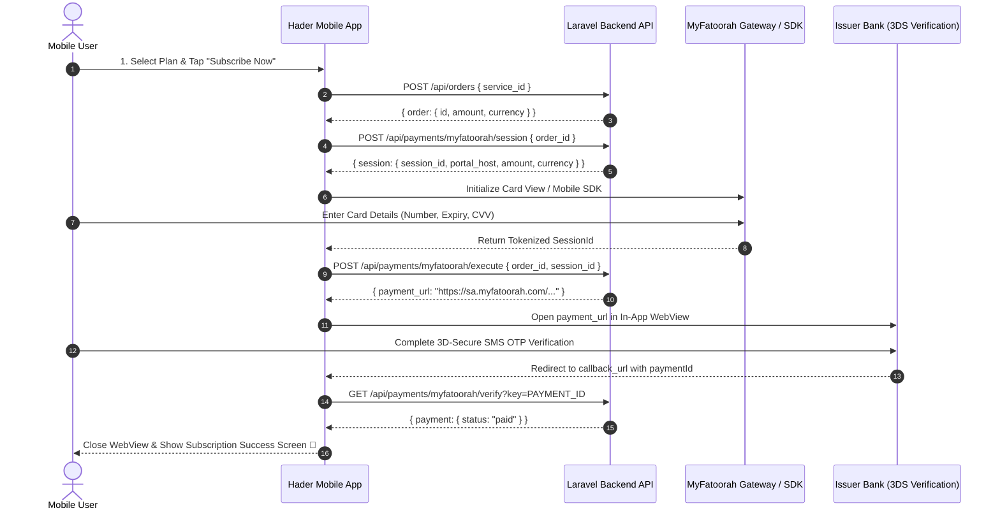

# 📱 MyFatoorah Mobile App Integration Plan - Hader (حضّر)

Document Version: 1.0  
Target Platforms: iOS & Android (Flutter / React Native / Native Swift & Kotlin)  
Backend API Base URL: `https://api.haderedu.com/api`

---

## 🎯 Overview
This document outlines the end-to-end integration specifications for integrating the MyFatoorah Payment Gateway into the **Hader Mobile Application**. The mobile integration reuses the existing Laravel backend payment APIs, providing a secure, 3D-Secure compliant, and seamless checkout experience for mobile users.

---

## 🔄 End-to-End Payment Architecture



---

## 🛠️ Step-by-Step API Specification

### Step 1: Create Order
Creates a new pending order for the selected subscription package.

- **Endpoint:** `POST /api/orders`
- **Headers:** `Authorization: Bearer <USER_TOKEN>`
- **Request Body:**
  ```json
  {
    "service_id": 2
  }
  ```
- **Response (201 Created):**
  ```json
  {
    "message": "تم إنشاء الطلب بنجاح",
    "order": {
      "id": 41,
      "service_id": 2,
      "amount": "99.00",
      "currency": "SAR",
      "status": "pending"
    }
  }
  ```

---

### Step 2: Initiate Payment Session
Fetches session configuration parameters and valid payment methods.

- **Endpoint:** `POST /api/payments/myfatoorah/session`
- **Headers:** `Authorization: Bearer <USER_TOKEN>`
- **Request Body:**
  ```json
  {
    "order_id": 41
  }
  ```
- **Response (200 OK):**
  ```json
  {
    "message": "تم إنشاء جلسة الدفع بنجاح",
    "session": {
      "order_id": 41,
      "session_id": "1d60c82d-e923-4138-88eb-c3cc07c94afd",
      "country_code": "SAU",
      "amount": 99.0,
      "currency": "SAR",
      "portal_host": "https://sa.myfatoorah.com",
      "callback_url": "https://haderedu.com/payment/myfatoorah/callback",
      "error_url": "https://haderedu.com/payment/myfatoorah/error"
    }
  }
  ```

---

### Step 3: Card Input & Tokenization (Mobile SDK / WebView)

There are two implementation options for collecting card details:

#### Option A (Recommended): Official MyFatoorah Mobile SDK
Use official packages provided by MyFatoorah:
- **Flutter:** [`myfatoorah_flutter`](https://pub.dev/packages/myfatoorah_flutter)
- **React Native:** [`myfatoorah-react-native`](https://www.npmjs.com/package/myfatoorah-react-native)

Initialization sample (Flutter):
```dart
MFSDK.init(
  session.portalHost,
  session.sessionId,
  MFCountry.SAUDI_ARABIA,
);
```

#### Option B: Embedded HTML WebView
Embed a localized HTML container inside an In-App WebView that renders MyFatoorah Session JS (`https://sa.myfatoorah.com/cardview/v2/session.js`).

---

### Step 4: Execute Payment & Get 3DS Bank URL
Submits the tokenized session ID to trigger payment execution and retrieve the bank 3DS authentication URL.

- **Endpoint:** `POST /api/payments/myfatoorah/execute`
- **Headers:** `Authorization: Bearer <USER_TOKEN>`
- **Request Body:**
  ```json
  {
    "order_id": 41,
    "session_id": "1d60c82d-e923-4138-88eb-c3cc07c94afd"
  }
  ```
- **Response (200 OK):**
  ```json
  {
    "message": "تم تنفيذ عملية الدفع بنجاح",
    "payment_url": "https://sa.myfatoorah.com/En/SAU/PayInvoice/MpgsAuthentication?paymentId=0808859183528351388484...",
    "invoice_id": "85918352",
    "payment_id": "0808859183528351388484"
  }
  ```

---

### Step 5: Handle 3D-Secure Navigation in In-App WebView
Open `payment_url` in an In-App WebView (`flutter_inappwebview` or `react-native-webview`).

Intercept URL changes using `onNavigationRequest` / `onPageStarted`:

```dart
// Flutter sample URL interception
onNavigationRequest: (NavigationRequest request) {
  if (request.url.contains('/payment/myfatoorah/callback')) {
    final uri = Uri.parse(request.url);
    final paymentId = uri.queryParameters['paymentId'];
    if (paymentId != null) {
      // Close WebView & trigger backend verification
      verifyPayment(paymentId);
    }
    return NavigationDecision.prevent;
  }
  return NavigationDecision.navigate;
}
```

---

### Step 6: Verify Payment & Activate Subscription
Verifies payment status with MyFatoorah and activates the user's subscription.

- **Endpoint:** `GET /api/payments/myfatoorah/verify?key=0808859183528351388484`
- **Headers:** `Authorization: Bearer <USER_TOKEN>`
- **Response (200 OK):**
  ```json
  {
    "message": "تم التحقق من عملية الدفع بنجاح",
    "payment": {
      "id": 35,
      "order_id": 41,
      "payment_method": "myfatoorah",
      "status": "paid",
      "amount": "99.00",
      "currency": "SAR",
      "paid_at": "2026-08-10T10:40:00.000000Z"
    }
  }
  ```

---

## ⚡ Error Handling & Edge Cases

| Case | Status Code | Handling |
| :--- | :---: | :--- |
| Invalid / Expired Session | `422` | Display error message & prompt user to retry card entry. |
| User Cancels 3DS | Redirect to `/error` | Close WebView & return to Checkout screen. |
| Network Loss during 3DS | Timeout | Show retry button & call `/api/payments/myfatoorah/verify` to check current status. |

---

## 📋 Integration Checklist for Mobile Team

- [ ] Add `myfatoorah_flutter` / `react-native-webview` dependency.
- [ ] Implement `POST /api/orders` & `POST /api/payments/myfatoorah/session` API calls.
- [ ] Configure `InAppWebView` with URL interception for `haderedu.com/payment/myfatoorah/callback`.
- [ ] Call `GET /api/payments/myfatoorah/verify` upon callback interception.
- [ ] Test end-to-end checkout with live Mada / Visa card in Saudi Arabia.
