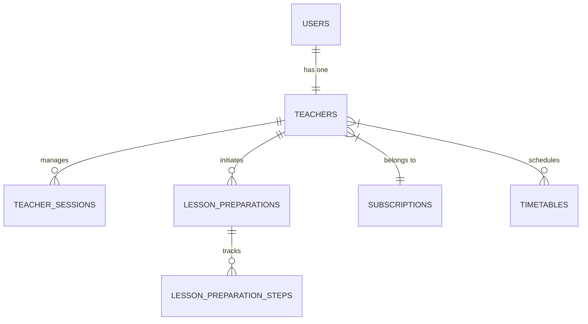
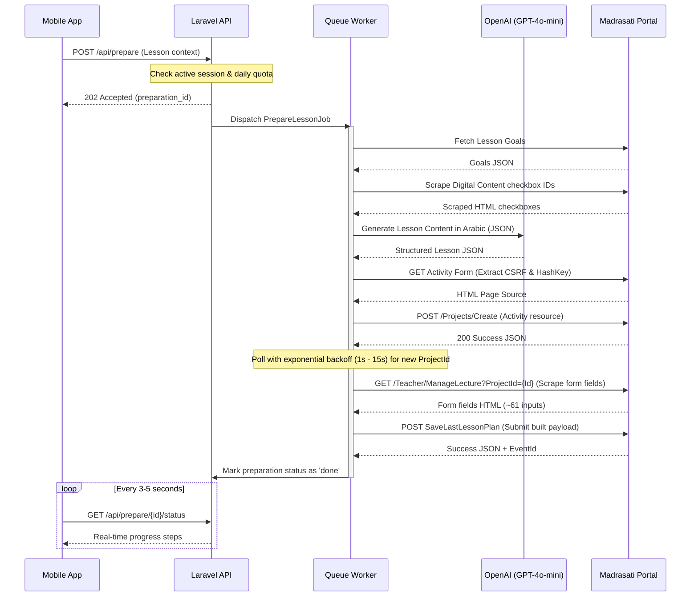

# Moeen Backend API - Project Documentation

Moeen is an AI-powered lesson preparation SaaS tailored for Saudi teachers using the Madrasati platform. It replaces a legacy Chrome extension by performing lesson orchestration, scraper-assisted DOM reading, AI generation, and final submission entirely server-side.

---

## 🏗️ Architectural Design

The backend is built using Laravel 11, adopting a clean architecture approach by segregating responsibilities into distinct domain, application, and infrastructure layers.

```
app/
├── Domain/              # Business Rules & Entities (Models, Services, DTOs)
│   ├── Auth/            # User authentication models
│   ├── Teachers/        # Profile, Session, & Quota rules
│   ├── Madrasati/       # Client wrapper & DOM scraping logic
│   ├── Lessons/         # Catalogue & main prep orchestration
│   ├── AI/              # OpenAI GPT content generation
│   ├── ContentBank/     # Teacher-owned & shared content items
│   └── Subscription/    # SaaS tiers and allowance calculations
│
├── Application/         # Entry points & Interfaces (HTTP Layer)
│   └── Http/
│       ├── Controllers/ # Thin controllers (routing & request handling)
│       ├── Requests/    # Incoming payload validation (Arabic errors)
│       ├── Resources/   # API Resource JSON response transformations
│       └── Middleware/  # Quota checks & session validation
│
└── Infrastructure/      # Concrete Implementations & Drivers
    ├── Persistence/     # Repositories for database encapsulation
    └── Queue/Jobs/      # Async workers for processing lesson prep jobs
```

---

## 💾 Core Database Schema

The database relies on **PostgreSQL** with specific `jsonb` indexing to support quick retrieval of structured fields.

### Major Entities



1. **`users`**: Root Laravel authentication table modified to include `role` (teacher, admin, school_admin), `phone`, and `active`.
2. **`teachers`**: Extends the user model with a link to their subscription plan, status, and Madrasati teacher code.
3. **`teacher_sessions`**: Stores the encrypted Madrasati cookie string (`session_cookie` is cast using Laravel's database encryption), CSRF tokens, and the currently linked school ID.
4. **`subscriptions`**: Plan catalog containing names, prices, monthly AI allowances, and daily lesson prep limits.
5. **`timetables`**: Stores weekly schedule slots linked to teachers, subjects, classrooms, and dates.
6. **`lessons`**: A catalog of subjects and specific lesson topics imported directly from Madrasati mapping files.
7. **`lesson_preparations`**: Tracks prep operations. Stores AI-generated JSON content, goals, selected digital attachments, and status indicators.
8. **`lesson_preparation_steps`**: Tracks granular status step-by-step (`fetch_goals`, `generate_ai_content`, `submit_to_madrasati`, etc.) for real-time progress polling.
9. **`content_items`**: The Content Bank containing teacher-made assignments, homework, templates, or shared public components.

---

## 🔄 Core Lesson Preparation Flow

When a teacher initiates a lesson preparation via the mobile app, the system runs through the following stages:



---

## 🔒 Security & Performance Guidelines

1. **Encrypted Session Cookies**: Raw cookie credentials parsed from the chrome extension are encrypted using AES-256-CBC database-level encryption via Laravel's Encrypted Casts on `TeacherSession.session_cookie`.
2. **Quota Gating Middleware**: Custom middlewares [CheckLessonQuota](file:///d:/Work/Aura/moeen-backend/app/Application/Http/Middleware/CheckLessonQuota.php) and [CheckMadrasatiSession](file:///d:/Work/Aura/moeen-backend/app/Application/Http/Middleware/CheckMadrasatiSession.php) prevent unauthorized or over-quota requests prior to entering controllers.
3. **Queue Processing**: Heavy HTTP operations are pushed into Redis and handled asynchronously via queue workers to keep API response times under 200ms.
4. **Caching Layer**: Catalogs like subject lists and lesson trees are cached with 1-hour TTLs to reduce repetitive database execution.
