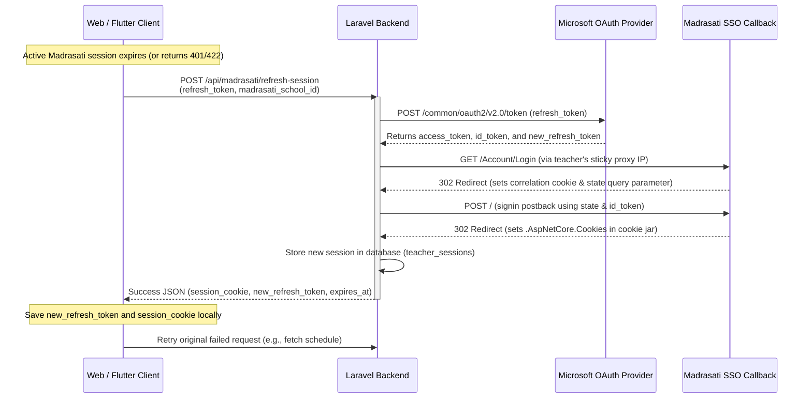

# Madrasati Silent Session Refresh Integration Plan (Web & Flutter Mobile)

This document provides a technical integration blueprint for the **Silent Session Refresh** feature, outlining the communication flows, state management, interceptor patterns, and error-handling steps for both the **Flutter Mobile App** and the **Web Frontend**.

---

## 1. Overview & Authentication Lifecycle



---

## 2. Flutter Mobile App Integration Guide

### 2.1 State Management & Storage
- **Refresh Token Storage**: The Microsoft `refresh_token` is a long-lived credential. It **must** be stored securely using `flutter_secure_storage` (never in shared preferences or unencrypted local databases).
- **Session Cookie Storage**: Storing the `.AspNetCore.Cookies` string in secure storage is recommended so that subsequent requests from the mobile app (if calling endpoints needing the cookie) have it locally.

### 2.2 HTTP Interceptor Pattern (Dio)
Implement a custom Dio Interceptor to automatically catch Madrasati session expired errors, run the silent refresh, update the secure storage, and replay the original request transparently.

```dart
import 'package:dio/dio.dart';
import 'package:flutter_secure_storage/flutter_secure_storage.dart';

class MadrasatiSessionInterceptor extends QueuedInterceptor {
  final Dio dio;
  final FlutterSecureStorage secureStorage = const FlutterSecureStorage();

  MadrasatiSessionInterceptor(this.dio);

  @override
  Future<void> onError(DioException err, ErrorInterceptorHandler handler) async {
    // 1. Detect Madrasati Session Expiration errors
    // Standard response codes: 401 Unauthorized or 422 with code: "missing_madrasati_auth_cookie"
    final response = err.response;
    if (response != null && 
        (response.statusCode == 401 || 
         (response.statusCode == 422 && response.data?['code'] == 'missing_madrasati_auth_cookie'))) {
      
      try {
        // 2. Fetch saved refresh token and school ID
        final refreshToken = await secureStorage.read(key: 'ms_refresh_token');
        final schoolId = await secureStorage.read(key: 'madrasati_school_id');

        if (refreshToken == null || schoolId == null) {
          // No tokens saved, force user to log in manually via WebView
          return handler.next(err);
        }

        // 3. Request silent session refresh from backend
        final refreshResponse = await dio.post(
          '/api/madrasati/refresh-session',
          data: {
            'refresh_token': refreshToken,
            'madrasati_school_id': schoolId,
          },
        );

        if (refreshResponse.statusCode == 200 && refreshResponse.data['success'] == true) {
          final data = refreshResponse.data['data'];
          final newCookie = data['session_cookie'];
          final newRefreshToken = data['new_refresh_token'];

          // 4. Save new credentials
          await secureStorage.write(key: 'madrasati_session_cookie', value: newCookie);
          await secureStorage.write(key: 'ms_refresh_token', value: newRefreshToken);

          // 5. Replay the original failed request
          final requestOptions = err.requestOptions;
          final clonedResponse = await dio.request(
            requestOptions.path,
            data: requestOptions.data,
            queryParameters: requestOptions.queryParameters,
            options: Options(
              method: requestOptions.method,
              headers: requestOptions.headers,
            ),
          );

          return handler.resolve(clonedResponse);
        }
      } on DioException catch (refreshErr) {
        // If the refresh request itself returns 401/403, the refresh token has expired/revoked
        if (refreshErr.response?.statusCode == 401) {
          // Clear credentials
          await secureStorage.delete(key: 'ms_refresh_token');
          await secureStorage.delete(key: 'madrasati_session_cookie');
          
          // Trigger Navigation to manual Madrasati WebView Login screen
          _navigateToManualLogin();
        }
      }
    }
    
    return handler.next(err);
  }

  void _navigateToManualLogin() {
    // Navigate to In-App WebView screen for fresh Microsoft login
  }
}
```

---

## 3. Web Frontend Integration Guide

The Web app integrates similarly, but has two options based on whether the user is utilizing the **Moeen Chrome Extension** or doing a direct OIDC authentication in the browser.

### 3.1 Scenario A: Chrome Extension Active
If the Chrome extension is active, it periodically updates cookies from the active Madrasati tab.
- **Action**: Let the extension handle cookie syncing. No action is required from the silent refresh endpoint.

### 3.2 Scenario B: Standalone Web App (No Extension)
If the teacher is using the browser without the Chrome extension:
- **Token Storage**: Store the `refresh_token` in `localStorage` (or secure HttpOnly session cookies if handled by the web server).
- **Refresh Flow**:
  1. Catch api calls returning `missing_madrasati_auth_cookie` or `madrasati_session_rejected`.
  2. Request `POST /api/madrasati/refresh-session` using `axios` or `fetch`.
  3. Update local token records.
  4. Replay the request.
  5. If the refresh endpoint returns 401, redirect the user to a page prompting them to log in via a popup window or iframe loaded with `https://schools.madrasati.sa`.

---

## 4. Key Error Handling Matrices

| Status Code | Error Code / Details | Cause | Action / Remediation |
| :--- | :--- | :--- | :--- |
| **`422`** | `missing_madrasati_auth_cookie` | Session expired on Madrasati portal | Trigger `POST /api/madrasati/refresh-session` |
| **`401`** | `session_refresh_failed` | Microsoft Refresh Token has expired, been revoked, or Madrasati rejected the exchange | Force user to open WebView and complete manual login |
| **`404`** | `teacher_not_found` | Current authenticated user is not registered as a teacher profile | Prompt user to complete registration or setup profile |
| **`422`** | Validation Errors | Missing payload fields or school ID is not 32 chars | Ensure payload format matches exactly |
